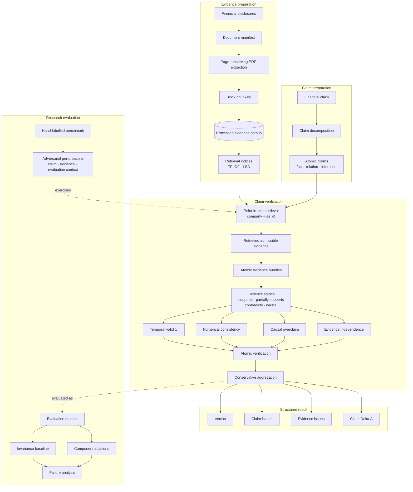

# Nummaria Veritas

**Evidence integrity for financial AI.**

Nummaria Veritas is a research-engineering framework for checking whether financial claims are justified by the evidence available at a given point in time.

The project started from a simple question:

> **Given the information legitimately available at the time, does this evidence actually justify this claim as stated?**

A claim can mention the right company, quote real numbers and cite genuine financial disclosures, and still be wrong. The evidence may have appeared too late, two apparently separate sources may come from the same disclosure, a number may be inconsistent with the underlying document, or several true facts may have been combined into a relationship the evidence never establishes.

Nummaria Veritas separates **semantic support** from **evidential admissibility** and returns structured verdicts, claim issues, evidence issues and, where the correction layer can resolve it, a minimum **Claim Delta (Δ)**.

---

## Research Question

Retrieval systems are good at finding passages that look relevant.

That does not necessarily answer:

> *Does the available evidence establish the claim?*

In financial reporting, a relevant passage can still be unusable:

- the disclosure may not have existed at the claim date;
- several documents may repeat the same underlying information;
- a numerical value may conflict with the claim even when the surrounding text looks right;
- the evidence may support the individual facts but not the relationship asserted between them;
- guidance may be written as though it were realised performance;
- Group-level claims may be paired with segment-level evidence;
- a harmless representational change should not change the judgment at all.

These are not really retrieval failures. The problem is the relationship between the evidence and the claim.

---

## System Architecture



Financial disclosures and claims are prepared separately and meet at retrieval. The claim is decomposed first, then each atomic proposition queries the processed financial corpus.

The benchmark reuses this workflow with controlled changes to the claim, evidence or evaluation context.

---

## Point-in-time retrieval

Temporal eligibility is applied **before ranking**.

For a claim evaluated at time \(t\), a corpus chunk is eligible only when:

```text
chunk.company == claim.company
and
chunk.publication_date <= claim.as_of_date
```

A later disclosure can be the strongest semantic match while still being unavailable at the claim date, so temporal filtering happens before ranking.

The project currently has:

- a lexical TF-IDF index;
- an LSA retrieval baseline built from TF-IDF + truncated SVD;
- retrieval performed separately for atomic propositions after claim decomposition.

LSA is used as the dense retrieval baseline; it is not a neural embedding model.

---

## Verification Model

### Evidence stance

Evidence stance is represented explicitly as:

```text
SUPPORTS
PARTIALLY_SUPPORTS
CONTRADICTS
NEUTRAL
```

`PARTIALLY_SUPPORTS` is used when the evidence establishes only part of the proposition.

For example, evidence may support both revenue growth and EPS growth without establishing that one happened *because of* the other.

The API currently receives stance assessments explicitly. It does not infer them itself.

### Executable verification mechanisms

The verifier currently has four independently switchable mechanisms.

**Temporal validity**

Excludes evidence published after the claim's `as_of_date`.

**Numerical consistency**

Extracts and compares financial values while preserving percentage, currency and scale semantics.

**Causal overclaim**

Flags causal claims when the evidence does not establish the asserted causal relationship.

**Evidence independence**

Groups supporting evidence by provenance and checks whether several citations really provide independent support.

An announcement and a presentation can look like two supporting documents while still tracing back to the same disclosure. Counting documents is not the same as counting independent evidence.

Atomic results are aggregated conservatively at parent-claim level.

---

## Verdicts

The verdict contract is:

```text
supported_claim
partially_supported_claim
contradicted_claim
unsupported_claim

invalid_evidence
insufficient_evidence
```

Examples:

- a valid claim paired with evidence from the wrong scope can produce `invalid_evidence`;
- a supported claim can still carry `evidence_redundancy`;
- a claim whose facts are supported but whose causal relationship is not established can produce `partially_supported_claim`.

---

## Failure Taxonomy

### Claim-level issues

```text
anachronistic_claim
numerical_inconsistency
metric_mismatch
period_mismatch
entity_scope_mismatch
forecast_as_fact
causal_overclaim
compositional_invalidity
```

### Evidence-level issues

```text
temporal_leakage
evidence_redundancy
contradictory_evidence
scope_mismatch
```

The benchmark taxonomy is broader than the four standalone verifier mechanisms. Some failure types currently exist only at the benchmark/evaluation layer.

---

## Claim Delta (Δ)

A Claim Delta is the smallest semantic change needed to make an unsupported or overstated claim defensible.

For example:

```text
AstraZeneca's FY2024 Total Revenue increased by 18% at CER.
```

can become:

```text
AstraZeneca's FY2024 Total Revenue increased by 21% at CER.
```

Automatic Claim Delta generation currently focuses on constrained numerical corrections. The generator:

- detects numerical inconsistency;
- preserves percentage, currency and scale compatibility;
- requires one compatible replacement from the evidence;
- abstains when the correction is ambiguous.

The benchmark also stores gold revised claims for causal, forecast and compositional failures. Those are evaluation targets; the current implementation does not generate every correction type automatically.

---

## Adversarial Benchmark

The benchmark progresses through:

```text
Atomic → Contextual → Compositional → Adversarial → Minimal Δ
```

Roughly:

- **Atomic** — can the individual fact be verified?
- **Contextual** — is it still correct under the right period, metric, scope and time?
- **Compositional** — are several supported facts being combined correctly?
- **Adversarial** — can the verifier catch a plausible-looking claim with a subtle integrity failure?
- **Minimal Δ** — if the claim fails, what is the smallest change needed to fix it?

The current corpus uses public reporting materials from:

**Issuers**

- HSBC
- AstraZeneca

**Reporting periods**

- FY2024
- H1 2025

The benchmark contains base financial claims plus eight adversarial perturbations.

Perturbations are described along two axes.

### What changed?

```text
numerical
metric
period
scope
temporal
representation
forecast_as_fact
causal
compositional
entity
redundancy
```

### Where did it change?

```text
claim
evidence
evaluation_context
```

---

## Experiments

### 1. Perturbation-invariance baseline

The baseline gives every perturbed case the same judgment as its original source claim.

```text
Cases:                       8
Verdict accuracy:            25.0%
Claim issue exact match:     50.0%
Evidence issue exact match:  75.0%
Correction exact match:      50.0%
Full case exact match:       12.5%
```

Only the representation perturbation remains a full match.

Run:

```bash
uv run python experiments/run_baseline.py
```

### 2. Component ablation study

Each independently switchable mechanism is disabled in turn.

The experiment asks:

1. Does the full system detect the targeted phenomenon?
2. Does that capability disappear once the responsible mechanism is removed?

| Configuration | Full detection | Ablation success |
| --- | ---: | ---: |
| without temporal validity | 100.0% | 100.0% |
| without numerical consistency | 100.0% | 100.0% |
| without causal check | 100.0% | 100.0% |
| without evidence independence | 100.0% | 100.0% |

Each ablation is evaluated on its corresponding targeted benchmark case, so these results measure mechanism attribution rather than general benchmark accuracy.

Run:

```bash
uv run python experiments/run_ablations.py
```

### 3. Failure analysis

The invariance baseline fails on seven of the eight adversarial perturbations:

```text
Failure rate:     87.5%
Full-match rate:  12.5%
```

| Dimension | Failed cases |
| --- | ---: |
| verdict | 6 |
| claim issues | 4 |
| correction | 4 |
| evidence issues | 2 |

Observed failure signatures:

```text
verdict                                      1
verdict + claim_issues + correction          4
verdict + evidence_issues                    1
evidence_issues                              1
none / full match                            1
```

These signatures reflect different kinds of failure: a numerical perturbation can affect the verdict, claim issues and correction, while redundancy may change only the evidence issues.

Run:

```bash
uv run python -m experiments.run_failure_analysis
```

---

## API

The API is built with FastAPI.

Start it locally:

```bash
uv run uvicorn nummaria_veritas.api.app:app --host 0.0.0.0 --port 8000
```

Health check:

```bash
curl http://localhost:8000/health
```

Expected response:

```json
{"status":"ok"}
```

Verification is available at:

```text
POST /verify
```

The request contains:

- parent claim metadata;
- atomic claims;
- evidence with provenance;
- evidence stance and an assessment explanation.

The response includes:

- parent verdict;
- claim issues;
- evidence issues;
- atomic verification results;
- supporting and contradictory evidence;
- structured explanations.

Logging records claim ID, company, number of atomic claims, verdict and issue counts. Full claim and evidence text are not logged.

---

## Docker

Build:

```bash
docker build -t nummaria-veritas .
```

Run:

```bash
docker run --rm -p 8000:8000 nummaria-veritas
```

Then:

```bash
curl http://localhost:8000/health
```

---

## Reproducibility

### Requirements

- Python 3.12+
- [`uv`](https://docs.astral.sh/uv/)

Install the locked environment:

```bash
uv sync --frozen
```

Run the quality gate:

```bash
uv run ruff format --check .
uv run ruff check .
uv run mypy src
uv run pytest
```

Run the experiments:

```bash
uv run python experiments/run_baseline.py
uv run python experiments/run_ablations.py
uv run python -m experiments.run_failure_analysis
```

---

## Project Structure

```text
nummaria-veritas/
├── configs/
│   └── documents.yaml
├── data/
│   ├── benchmark/
│   ├── processed/
│   └── raw/
├── docs/
│   └── project_scope.md
├── experiments/
│   ├── run_ablations.py
│   ├── run_baseline.py
│   └── run_failure_analysis.py
├── src/nummaria_veritas/
│   ├── api/
│   ├── correction/
│   ├── decomposition/
│   ├── evaluation/
│   ├── evidence/
│   ├── ingestion/
│   ├── retrieval/
│   └── verification/
└── tests/
```

---

## Limitations

Nummaria Veritas is a research MVP.

- evidence stance is supplied explicitly rather than inferred autonomously;
- dense retrieval currently uses LSA rather than a neural embedding model;
- evidence independence currently relies on deterministic provenance clustering rather than modelling richer evidence lineage or document relationships;
- only four failure dimensions currently have standalone, independently ablatable verifier mechanisms: temporal validity, numerical consistency, causal overclaim and evidence independence;
- automatic Claim Delta generation is currently limited to constrained numerical corrections;
- the adversarial benchmark is currently small and hand-labelled, so the evaluation provides targeted coverage rather than broad statistical validation;
- the corpus currently covers two issuers and a limited set of reporting periods.

---

## Design Scope

See [`docs/project_scope.md`](docs/project_scope.md) for the benchmark design, failure model and MVP boundaries.