# Nummaria Veritas

**Evidence integrity for financial AI.**

Nummaria Veritas is a research-engineering framework for evaluating whether financial claims are justified by the evidence available at a given point in time.

It asks a narrower and stricter question than whether a retrieved passage is relevant to a claim:

> **Given the information legitimately available at the time, does this evidence actually justify this claim as stated?**

A financial claim can contain the right company, plausible numbers and citations to genuine disclosures — and still be indefensible. The failure may lie in when the evidence became available, whether apparently independent citations share the same provenance, whether values are numerically compatible, or whether supported facts have been combined into an unsupported relationship.

Nummaria Veritas separates **semantic support** from **evidential admissibility** and produces structured verdicts, claim-level issues, evidence-level issues and, where supported by the current correction layer, a minimum **Claim Delta (Δ)**.

---

## Research Question

Retrieval systems are good at answering:

> *Which passages look relevant to this statement?*

That is not the same as answering:

> *Does the available evidence establish this statement?*

For financial AI, the distinction matters because evidence can be semantically relevant while still being unusable or insufficient:

- a disclosure may have been published after the claim's `as_of_date`;
- several documents may repeat the same underlying disclosure;
- a numerical value may conflict with the claim;
- individually supported facts may not establish the relationship asserted between them;
- guidance may be represented as realised performance;
- Group-level claims may be paired with segment-level evidence;
- an innocuous representational change may preserve the original judgment.

Nummaria Veritas models these as failures in the **evidence-to-claim relationship**, rather than as retrieval failures alone.

---

## System Architecture

```mermaid
flowchart TD
    A[Financial disclosures<br/>HSBC + AstraZeneca PDFs]

    subgraph INGESTION["1. Document ingestion"]
        B[Document manifest<br/>company · period · publication date]
        C[Page-preserving PDF extraction]
        D[Block chunking]
        E[(Processed evidence corpus)]
    end

    subgraph RETRIEVAL["2. Point-in-time retrieval"]
        F[Eligibility filter<br/>company + as_of]
        G[Lexical retrieval<br/>TF-IDF]
        H[Dense baseline<br/>LSA]
        I[EvidenceResult<br/>provenance + score]
    end

    subgraph CLAIMS["3. Claim representation"]
        J[Financial claim]
        K[Claim decomposition]
        L[Atomic claims<br/>fact · relation · inference]
        M[Atomic evidence bundles]
    end

    subgraph VERIFICATION["4. Evidence-integrity verification"]
        N[Evidence stance<br/>supports · partially supports<br/>contradicts · neutral]

        O[Temporal validity]
        P[Numerical consistency]
        Q[Causal overclaim]
        R[Evidence independence]

        S[Atomic verification]
        T[Conservative aggregation]
    end

    subgraph OUTPUT["5. Structured result"]
        U[Verdict]
        V[Claim issues]
        W[Evidence issues]
        X[Claim Delta Δ]
    end

    subgraph EVALUATION["6. Adversarial evaluation"]
        Y[Hand-labelled benchmark]
        Z[Perturbations<br/>claim · evidence · context]
        AA[Invariance baseline]
        AB[Component ablations]
        AC[Failure analysis]
    end

    subgraph SERVICE["7. Engineering interface"]
        AD[FastAPI /verify]
        AE[Structured logging]
        AF[Docker runtime]
    end

    A --> B --> C --> D --> E

    E --> F
    F --> G
    F --> H
    G --> I
    H --> I

    J --> K --> L
    I --> M
    L --> M

    M --> N

    N --> O
    N --> P
    N --> Q
    N --> R

    O --> S
    P --> S
    Q --> S
    R --> S

    S --> T

    T --> U
    T --> V
    T --> W
    T --> X

    Y --> Z
    Z --> AA
    Z --> AB
    AA --> AC
    AB --> AC

    AD --> N
    T --> AD
    AD --> AE
    AD --> AF
```



### Point-in-time retrieval

Temporal eligibility is enforced **before ranking**.

For a claim evaluated at time \(t\), a corpus chunk is eligible only when:

```text
chunk.company == claim.company
and
chunk.publication_date <= claim.as_of_date
```

Future disclosures therefore cannot improve a historical retrieval result simply because they are semantically closer to the query.

The project implements:

- a lexical TF-IDF index;
- an LSA dense-retrieval baseline built from TF-IDF + truncated SVD;
- claim decomposition followed by evidence retrieval per atomic proposition.

The LSA implementation is intentionally treated as a reproducible retrieval baseline rather than presented as a neural embedding model.

---

## Verification Model

### Evidence stance

Semantic stance is represented explicitly:

```text
SUPPORTS
PARTIALLY_SUPPORTS
CONTRADICTS
NEUTRAL
```

This allows the system to distinguish, for example, evidence that supports the underlying financial facts from evidence that establishes the stronger relationship asserted by a claim.

A causal claim can therefore be **partially supported** when its component facts are established but the causal link itself is not.

The current API accepts stance assessments explicitly rather than pretending that semantic stance classification is already an autonomous model.

### Executable verification mechanisms

The current verifier contains four independently switchable mechanisms:

**Temporal validity**  
Excludes evidence published after the claim's `as_of_date`.

**Numerical consistency**  
Extracts and compares financial numerical values while preserving percentage, currency and scale semantics.

**Causal overclaim**  
Flags causal propositions when admissible evidence does not establish the asserted causal relationship.

**Evidence independence**  
Clusters supporting evidence by provenance and flags apparent corroboration that does not increase the number of independent evidence sources.

These mechanisms feed atomic verification, followed by conservative parent-claim aggregation.

---

## Verdicts

Nummaria Veritas uses the following verdict contract:

```text
supported_claim
partially_supported_claim
contradicted_claim
unsupported_claim

invalid_evidence
insufficient_evidence
```

The separation between claim failure and evidence failure is deliberate.

For example:

- a valid claim paired with evidence from the wrong scope can produce `invalid_evidence`;
- a supported claim can still carry `evidence_redundancy`;
- a claim whose underlying facts are established but whose causal relationship is not can produce `partially_supported_claim`.

---

## Failure Taxonomy

### Claim-level issues

```text
anachronistic_claim
numerical_inconsistency
metric_mismatch
period_mismatch
entity_scope_mismatch
forecast_as_fact
causal_overclaim
compositional_invalidity
```

### Evidence-level issues

```text
temporal_leakage
evidence_redundancy
contradictory_evidence
scope_mismatch
```

The broader taxonomy is intentionally larger than the set of currently independent verifier modules. Some dimensions are represented primarily through the benchmark and evaluation layer while the executable verifier is expanded incrementally.

---

## Claim Delta (Δ)

A Claim Delta represents the minimum semantic correction required to make an invalid or overstated claim defensible.

For example:

```text
AstraZeneca's FY2024 Total Revenue increased by 18% at CER.
```

can be corrected to:

```text
AstraZeneca's FY2024 Total Revenue increased by 21% at CER.
```

without rewriting the rest of the statement.

The current automatic correction implementation focuses on constrained **numerical Claim Delta generation**. It:

- detects numerical inconsistency;
- preserves percentage, currency and scale compatibility;
- requires a unique compatible replacement from the evidence;
- abstains when the correction is ambiguous.

The benchmark additionally stores gold revised claims for broader failure types such as causal, forecast and compositional overstatement. These are evaluation targets rather than claims that every correction type is already generated automatically.

---

## Adversarial Benchmark

The benchmark is designed around the progression:

```text
Atomic → Contextual → Compositional → Adversarial → Minimal Δ
```

The current corpus uses public reporting materials from:

- HSBC
- AstraZeneca
- FY2024
- H1 2025

The benchmark contains base financial claims and eight adversarial perturbations.

Perturbations are described along two axes.

### What changed?

```text
numerical
metric
period
scope
temporal
representation
forecast_as_fact
causal
compositional
entity
redundancy
```

### Where did it change?

```text
claim
evidence
evaluation_context
```

This distinction matters because changing the claim, changing its evidence and changing the evaluation date can affect different layers of the verification result.

---

## Experiments

### 1. Perturbation-invariance baseline

The naïve baseline assumes that a perturbed case should inherit the verification state of its unperturbed source claim.

That assumption fails quickly.

```text
Cases:                       8
Verdict accuracy:            25.0%
Claim issue exact match:     50.0%
Evidence issue exact match:  75.0%
Correction exact match:      50.0%
Full case exact match:       12.5%
```

Only the representation perturbation remains a full match.

This provides a simple empirical demonstration that semantic similarity or source-claim inheritance is not sufficient for evidence-integrity evaluation.

Run it with:

```bash
uv run python experiments/run_baseline.py
```

### 2. Component ablation study

Each currently independent verification mechanism is disabled in turn.

The experiment asks two questions:

1. Does the full system detect the targeted phenomenon?
2. Does that targeted capability disappear when its responsible mechanism is removed?

| Configuration | Full detection | Ablation success |
| --- | ---: | ---: |
| without temporal validity | 100.0% | 100.0% |
| without numerical consistency | 100.0% | 100.0% |
| without causal check | 100.0% | 100.0% |
| without evidence independence | 100.0% | 100.0% |

These are targeted component-sensitivity results, not a claim that the verifier has 100% general benchmark accuracy.

They show that each implemented mechanism contributes an observable capability rather than existing only as an architectural abstraction.

Run:

```bash
uv run python experiments/run_ablations.py
```

### 3. Failure analysis

The invariance baseline fails on seven of eight adversarial perturbations:

```text
Failure rate:     87.5%
Full-match rate:  12.5%
```

Observed failed evaluation dimensions:

| Dimension | Failed cases |
| --- | ---: |
| verdict | 6 |
| claim issues | 4 |
| correction | 4 |
| evidence issues | 2 |

The failure signatures are structurally different:

```text
verdict                                      1
verdict + claim_issues + correction          4
verdict + evidence_issues                    1
evidence_issues                              1
none / full match                            1
```

This distinction is important. A scope perturbation and a numerical perturbation may both cause the baseline to fail, but they fail different parts of the verification contract.

Run:

```bash
uv run python -m experiments.run_failure_analysis
```

---

## API

A FastAPI interface exposes the verification engine without hiding semantic stance inference inside the service.

Start locally:

```bash
uv run uvicorn nummaria_veritas.api.app:app --host 0.0.0.0 --port 8000
```

Health check:

```bash
curl http://localhost:8000/health
```

Expected response:

```json
{"status":"ok"}
```

Verification is exposed through:

```text
POST /verify
```

The request contains:

- parent claim metadata;
- atomic claims;
- evidence with provenance;
- an explicit evidence stance and assessment explanation.

The response contains:

- parent verdict;
- claim issues;
- evidence issues;
- atomic verification results;
- supporting and contradictory evidence;
- structured explanations.

The service logs verification metadata such as claim ID, company, number of atomic claims, verdict and issue counts without logging complete claim or evidence text.

---

## Docker

Build:

```bash
docker build -t nummaria-veritas .
```

Run:

```bash
docker run --rm -p 8000:8000 nummaria-veritas
```

Then:

```bash
curl http://localhost:8000/health
```

---

## Reproducibility

### Requirements

- Python 3.12+
- [`uv`](https://docs.astral.sh/uv/)

Install the locked environment:

```bash
uv sync --frozen
```

Run the quality gate:

```bash
uv run ruff format --check .
uv run ruff check .
uv run mypy src
uv run pytest
```

Run the research experiments:

```bash
uv run python experiments/run_baseline.py
uv run python experiments/run_ablations.py
uv run python -m experiments.run_failure_analysis
```

---

## Project Structure

```text
nummaria-veritas/
├── configs/
│   └── documents.yaml
├── data/
│   ├── benchmark/
│   ├── processed/
│   └── raw/
├── docs/
│   └── project_scope.md
├── experiments/
│   ├── run_ablations.py
│   ├── run_baseline.py
│   └── run_failure_analysis.py
├── src/nummaria_veritas/
│   ├── api/
│   ├── correction/
│   ├── decomposition/
│   ├── evaluation/
│   ├── evidence/
│   ├── ingestion/
│   ├── retrieval/
│   └── verification/
└── tests/
```

---

## Current Limitations

Nummaria Veritas is a research MVP, not a production financial decision system.

Current boundaries include:

- semantic evidence stance is supplied explicitly rather than inferred autonomously;
- LSA is used as the dense retrieval baseline rather than a neural embedding model;
- evidence independence currently uses deterministic provenance clustering rather than a learned or graph-based evidence-genealogy model;
- only temporal validity, numerical consistency, causal overclaim and evidence independence are independently ablatable verifier mechanisms;
- automatic Claim Delta generation is currently strongest for constrained numerical corrections;
- the adversarial benchmark is deliberately small and hand-labelled;
- the corpus currently covers two issuers and a limited set of reporting periods.

These constraints are intentional: the project prioritises explicit contracts, point-in-time correctness, reproducibility and interpretable failure analysis before increasing model complexity.

---

## Design Scope

The deeper design rationale, benchmark philosophy, failure model and MVP boundaries are documented in [`docs/project_scope.md`](docs/project_scope.md).